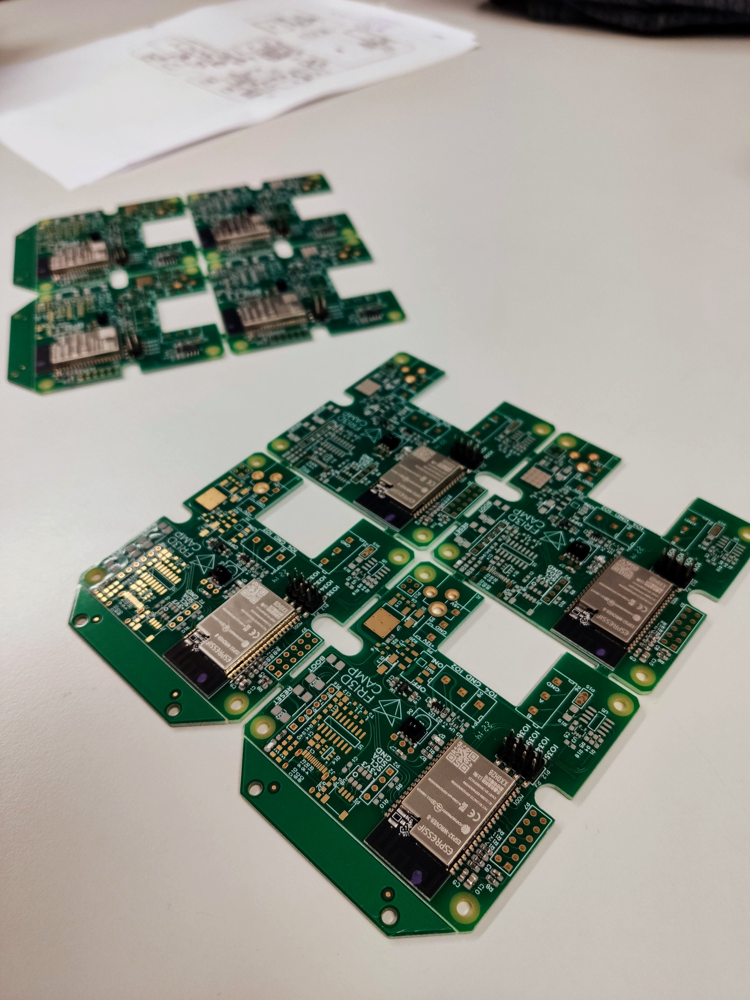
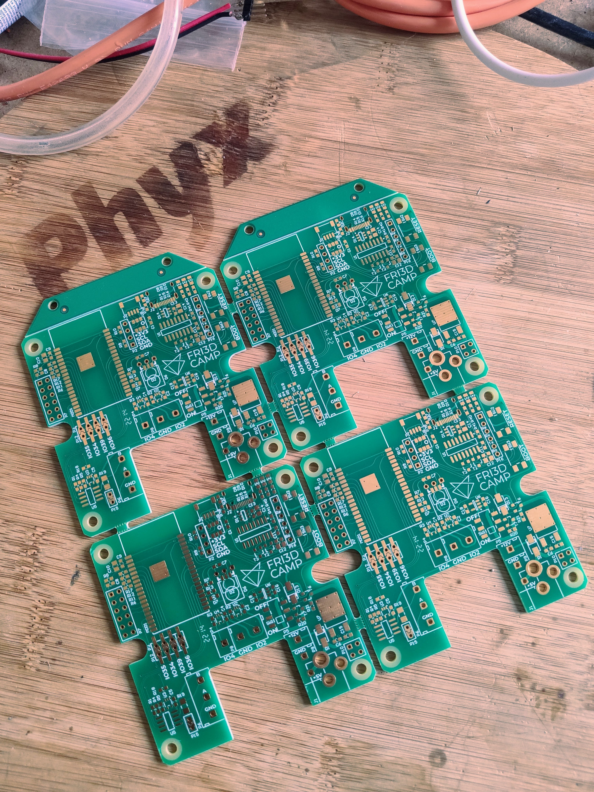
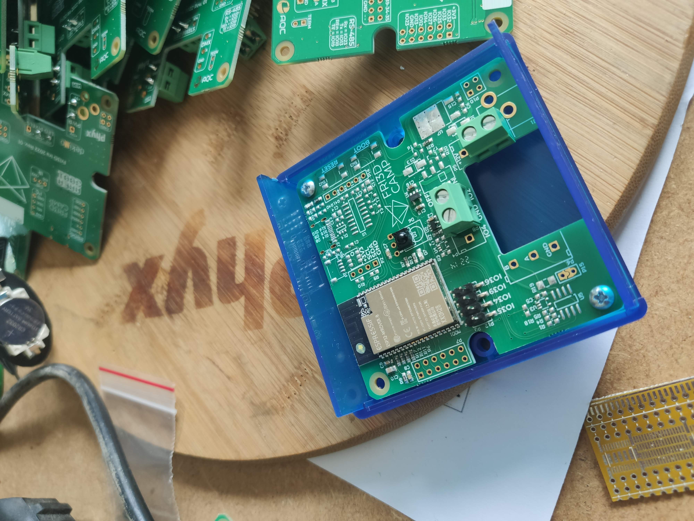
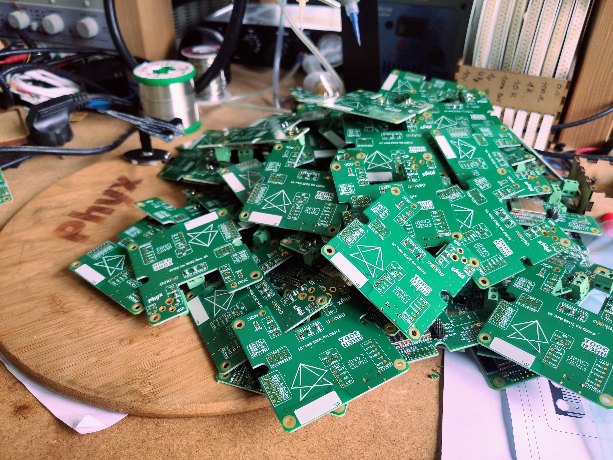

# IRA
IRA, named after the [mother of the stars in Polynesisn mythology](https://en.wikipedia.org/wiki/Ira_(mythology)) is the controller for the lights at [Fri3d Camp](https://fri3d.be/) based around the ESP-WROVER-32. The design was made to fit in the [Hammond 1593ARTBU](https://www.hammfg.com/part/1593ARTBU?referer=741) housing.

## REV 00
Initial prototype of the IRA controller.

## REV 01
Production version of the IRA, most of the boards have 2 buffered outputs, 20 have been fitted with RS-485 hardware for DMX. Changes compared to REV 00 : Added clearance around screw holes, added text around switches and increased documentation on silk layers.

## REV 02
Modified version of the 01 revision with less free IO but 8 buffered outputs for WS2812-style adressable LEDs. 12V power has been upgraded to a switching power supply and 2 soldered threaded standoffs are added which can be used as power distribution points. The expansion header has all the pins for I²C or I²S expansions. Onboard I²C has been removed and a [Tag-Connect](https://www.tag-connect.com/product/tc2030-idc-nl) programming header was added. 

There are various stuffing options : 
- Default : 12V or 5V Power, 8 buffered outputs
- Default DMX : 12V or 5V Power, 8 buffered outputs, DMX
- Minimal : 5V Power, 2 buffered outputs
- Minimal DMX : 5V Power, 2 buffered outputs, DMX
- Development : 12V or 5V Power, 8 buffered outputs, DMX, USB Serial convertor with USB-C connector

# Pictures

